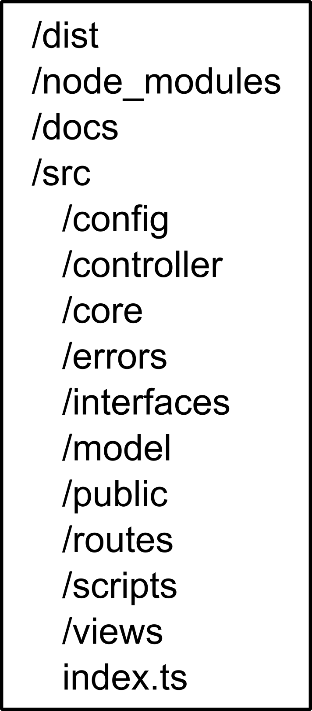

# TFG Node
Trabajo de fin de grado con Node.js, Firebase y TailwindCSS

----

## Índice

**Haz click sobre algún apartado para moverte a el**


* [**Autenticación de usuarios con Node.js y Firebase**](#autenticación-de-usuarios-con-nodejs-y-firebase)
    * [**Descripción**](#descripción)
    * [**Tecnologias Usadas**](#tecnologias-usadas)
    * [**Dependencias**](#dependencias)
        * [**Dependecias Normales**](#dependecias-normales)
        * [**Dependecias de desarrollo**](#dependecias-de-desarrollo)
    * [**Bibliografías**](#bibliografías)
    * [**Licencia**](#licencia)
* [**Instalación y configuración necesaria**](#instalación-y-configuración-necesaria)
    * [**Requistos**](#requistos)
    * [**Instalación**](#instalación)
        * [**Instalar desde código compilado**](#instalar-desde-código-compilado)
        * [**Instalar desde el código fuente**](#instalar-desde-el-código-fuente)
    * [**Configuración de Firestore**](#configuración-de-firestore)
    * [**Archivos de configuración de la aplicación**](#archivos-de-configuración-de-la-aplicación)
    * [**Archivos de configuración**](#archivos-de-configuración)
    * [**Scripts de desarrollo y ejecución**](#scripts-de-desarrollo-y-ejecución)
    * [**Estructura de almacenamiento**](#estructura-de-almacenamiento)
    * [**Acceso a la aplicación**](#acceso-a-la-aplicación)
    * [**Entornos de ejecución**](#entornos-de-ejecución)
    * [**Depuración del código**](#depuración-del-código)
----
## Autenticación de usuarios con Node.js y Firebase

### Descripción
Proyecto desarrollado como trabajo de fin de grado para el ciclo formativo DAW

### Tecnologias Usadas

* **Nodejs**, entorno de ejecución de JavaScript
* **NPM**, gestor de paquetes de JavaScript
* **Plataforma Firebase**, únicamente su base de datos, Firestore
* **TypeScript**, superconjunto de JavaScript, lenguaje de programación usado en elproyecto
* **Express**, librería de Nodejs permite una rápida configuración de un servidor
* **Tailwindcss**, librería de css
* **EJS**, sistema de plantillas de código JavaScript embebido

### Dependencias 

**Pincha sobre una dependencia para ir la pagina de NPM de esta**

#### Dependecias Normales
* [**Express**](https://www.npmjs.com/package/express)
* [**EJS**](http://npmjs.com/package/ejs)
* [**Crypto-js**](https://www.npmjs.com/package/crypto-js), permite usar funciones HASH para encriptar datos.
* [**Cookie-parser**](https://www.npmjs.com/package/cookie-parser), middleware encargado de analizar las cookies y convertirlas a un objeto, necesario para el uso de la sesión.
* [**Express-session**](https://www.npmjs.com/package/express-session), permite la creación y uso de sesiones de manera sencilla
* [**Firebase-admin**](https://www.npmjs.com/package/firebase-admin), librería  para trabajar con la base de datos, Frestore.

#### Dependecias de desarrollo

* [**TypeScript**](https://www.npmjs.com/package/typescript), compilador de TypeScript a JavaScript
* [**Copyfiles**](https://www.npmjs.com/package/copyfiles), permite copiar archivos en función de los parámetros. Permitiendo copiar los archivos en la carpeta de salida al compilar
* [**Nodemon**](https://www.npmjs.com/package/nodemon), reinicia de forma automática el servidor cada vez que se realizan cambios, evitando tener que reiniciar constantemente
* [**EsLint**](https://www.npmjs.com/package/eslint), librería que analiza sintácticamente el código
* [**Postcss**](https://www.npmjs.com/package/postcss), permite convertir CSS mediante JavaScript, es una dependencia opcional de tailwindcss
* [**Postcss-cli**](https://www.npmjs.com/package/postcss-cli), interfaz de línea de comandos de postcss
* [**Tailwindcss**](https://www.npmjs.com/package/tailwindcss)
* [**Autoprefixer**](https://www.npmjs.com/package/autoprefixer), dependencia recomendada para tailwindcss, añade prefijos al código css. Como *-moz-*, *-ms-*, *-webkit-*. Ver [*Vendor Prefix*](https://developer.mozilla.org/es/docs/Glossary/pos)
* **@types**, archivos de declaración, permite a TypeScript usar paquetes JavaScript. Un archivo de declaración proporciona información sobre los archivos JavaScript.

### Bibliografías

**Páginas consultadas durante el desarrollo del proyecto**
Son todas páginas de la documentación oficial, debido a la gran cantidad de paginas y foros consultados.

* [Documentación EJS](https://ejs.co/)
* [Documentación Express](http://expressjs.com/en/4x/api.html)
* [Documentación TypeScript](https://www.typescriptlang.org/docs/)
* [Documentación Node](https://nodejs.org/dist/latest-v14.x/docs/api/)
* [Documentación Firebase](https://firebase.google.com/docs)
* [Documentación TailwindCSS](https://tailwindcss.com/docs)
* [Documentación EsLint](https://eslint.org/docs/rules/)
* [Documentación Copyfiles](https://github.com/calvinmetcalf/copyfiles#readme)
* [Developer Mozilla](https://developer.mozilla.org/es/docs/Web/Guide)

### Licencia

Proyecto distribuido bajo lincencia MIT. Mas información en la [licencia](./LICENSE)

----
## Instalación y configuración necesaria

### Requistos

* **Nodejs (v14)**
* **Npm**
* **Cuenta de google para Firebase**
* **Clave privada de Firebase Admin SDK**
* **Certificado SSL (Opcional)**
* **Git (Opcional)**

### Instalación 

**Es necesario al menos una clave privada de la base de datos. [Archivos de configuración](#archivos-de-configuración-de-la-aplicación)**

#### Instalar desde código compilado

Descargar el [código compilado](https://github.com/LuisPFdez/TFG-Node/releases/latest)

Al descomprimir el código, deben de aparecer dos archivos y una carpeta (**_package.json_**, **_package-lock.json_** y **_dist_** ). 

Antes de ejecutar la aplicación es necesario instalar las dependencias con `npm install --production`. 
Es necesario no olvidar el parametro **--production**, de lo contrario instalará también las dependencias de desarrollo.

Una vez finalizado generará una carpeta llamada *node_modules*, con las dependencias necesarias.

Con el comando `npm start` se ejecutará la aplicación, en caso de que no funcione ejecuta `node dist/index.js` 

#### Instalar desde el código fuente

Descarga el código fuente con `git clone https://github.com/LuisPFdez/TFG-Node.git` o descargar el comprimido

Instalar las dependencias con `npm install`. Al final, deberá de haber generado una carpeta llamada *node_modules*

Compilar el código con el comando `npm run build`, esto deberá de generar una carperta llamada **dist**

Una vez compilado, puedes ejecutarlo con `npm start` o `node dist/index.js`


**Para acceder a la [aplicación](#acceso-a-la-aplicación)**
### Configuración de Firestore
[Configuración básica de Firebase](./docs/Configuracion_Firebase.pdf)

Las reglas de la base de la base de datos no influyen en el proyecto, debido a que este necesita de la clave privada para funcionar. 

Sin embargo, la base de datos contrendrá información sensible, como son las contraseñas, por lo que es recomendable tener bastante restringido el acceso a esta.

La siguente configuración solo permite el acceso por clave privada.


En caso de necesitar hacer una caga inicial en la base de datos es recomendable usar el [script](./src/scripts/baseDatos.ts) proporcinado.

### Archivos de configuración de la aplicación

La aplicación necesita de dos archivos de configuración necesario para funcionar, y de otros dos opcionales, aunque recomendados por seguridad. 

* [ConfigDB.json](./src/config/ConfigDB.json) 
Clave privada de la base de datos, ha de ser llamada obligatoriamente **ConfigDB.json** 
* [Config.json](./src/config/Config.json) 
Archivo de configuración que especifica: 
    * **Puerto**: El puerto en el estará escuchando la aplicación, por defecto el puerto **3000**
    * **N_Cert**: Nombre de los certificados SSL, por defecto **clave**
    * **Coleccion**: Nombre de la colleción de la base de datos, por defecto **Usuarios**
    * **Rutas**: objeto con las rutas relativas de las vistas, siendo [views](./src/views) el directorio padre, son necesarias para el renderizado 

* Archivos para el certificado SSL
Archivos opcionales para HTTPS, sus extensiones han de ser **.key** para la clave privada y **.crt** para el certificado firmado. 

Sus nombres han de coincidir con N_Cert de Config.json.

La aplicación por esta programada para crear un servido HTTPS, para crear un servidor HTTP es necesario modificar el [index.ts](./src/index.ts)

**Comentar o eliminar**
```ts
const credenciales = {
    key: readFileSync(path.join(__dirname, "./config/" + config.N_Cert + ".key")),
    cert: readFileSync(path.join(__dirname, "./config/" + config.N_Cert + ".crt"))
};
```
```ts
https.createServer(credenciales, app).listen(config.Puerto);
```

**Y descomentar**
```ts
app.listen(config.Puerto);
```

### Archivos de configuración
* [.eslintignore](./.eslintignore)
Archivo que le indica a ESLint que ficheros o directorios ignorar

* [.eslintrc.json](./.eslintrc.json)
Archivo de configuración de ESLint

* [.gitignore](./.gitignore)
Archivo que indica a git a que carpetas o archivos, ignorar en el commit

* [package.json](./package.json)
Archivo de configuración de NPM, entre sus multiples funciones, indica el repositorio del proyecto, sus dependencias, normales y de desarrollo y script para facilitar el proceso de desarrollo e instalación.

* [postcss.config.js](./postcss.config.js)
Archivo de configuración para postcss 

* [tailwind.config.js](./tailwind.config.js)
Archivo de configuración para tailwindcss

* [tsconfig.json](./tsconfig.json)
Archivo de configuración para el compilador de typescript, le indica la carpeta de salida, el directorio del código fuente, las librerías necesarias para la compilación...

### Scripts de desarrollo y ejecución
NPM, a travás del archivo package.json, permite el uso de scripts para tareas repetitivas. Salvo ciertos scripts predefinidos como **npm start**, la mayoria de ellos se ejecutan como **npm run** seguido de su nombre.

**Algunos script se componen de otros para aprovechar sus funciones**

* **start** -- `npm start`
Ejecuta la aplicación 

* **dev** -- `npm run dev`
Ejecuta la aplicación con nodemon, librería que evita tener que reiniciar el servidor al realizar algún cambio en el código.

* **devBuild** -- `npm run devBuild`
Cmpila la aplicación (usa el script build) y la ejecuta con nodemon

* **build** -- `npm run build`
Compila el código de TypeScript a JavaScript y copia los demas archivos a la carpeta de salida. Compuesto por los scripts lint y css

* **lint** -- `npm run lint`
Comprueba la sintaxis de TypeScript y JavaScript. Puede lanzar errores o advertencias. Los errores detentran el script, por ejemplo, impedirá la compilación del código

* **css** -- `npm run css`
A través de postcss transforma el contenido de tailwind.config.js y public/estilo.css en css puro. Incluyendo el css base de tailwindcss

* **dbInit** -- `npm run dbInit`
Ejecuta el script de la carga inicial de la base de datos

### Estructura de almacenamiento

El código fuente se compone de 2 carpetas. A las que hay que añadir otra necesaria para los módulos y la carpeta que genera el compilador.

* **dist**, código compilado, generado por el compilador de TypeScript, posee una estructura similar a **src**
* **docs**, archivos de documentación e imágenes.
* **node_modules**, carpeta donde se encuentra el código de las dependencias, se genera de forma automática. 
* **src**, carpeta que contiene el código fuente
    * **config**, archivos de configuración como la clave privada, certificado SSL o archivo JSON de configuración
    * **controller**, contiene los módulos con las funciones necesarias para que la aplicación funcione. Como funciones para la autenticación o middlewares. Tambien contiene un fichero de tipos
    * **core**, conjunto de archivos, independientes de la aplicación, pero necesarios para el funcionamiento de esta.
    * **errors**, carpeta donde se almacenan las excepciones.
    * **model**, clases que proporcionan una estructura para la manipulación de los datos. 
    * **public**, carpeta para el servicio de [archivos estaticos](https://expressjs.com/es/starter/static-files.html) de Express
    * **routes**, carpeta que contiene los [metodos de rutas](https://expressjs.com/es/guide/routing.html) de Express
    * **scripts**, scripts que facilitan ciertas tareas, como la carga inicial de información en la base de datos
    * **views**, contiene todas las plantillas EJS
    * **index.ts**, archivo principal.


**Esquema de la estructura de forma mas detallada**
<!--Imagen insertada con codigo HTML para especificar la altura-->



### Acceso a la aplicación
El acceso a la aplicacion es a través de un **navegador web**. Depende de tres factores:
1. El protocolo utilizado
Que puede ser **HTTPS** o **HTTP**
2. La ruta
Puede ser un nombre o una IP, si es un nombre ha de estar asociado a una IP, mediante un DNS. 
En caso de que la aplicación se ejecute en el mismo equipo desde el que se accede la ruta puede ser la **127.0.0.1** o **localhost**
3. El puerto
Por defecto si no es especificado los navegadores acceden al puerto **80**

La ruta se compondria por 
```
protocolo://nombre-o-IP:Puerto
```
Por ejemplo la ruta por defecto de la aplicacion seria 
```
https://localhost:3000
```
### Entornos de ejecución 

Todos los comandos son validos para el **entorno de desarrollo** y el **entorno de explotación.**

Ambos necesitan únicamente **Node** y **NPM** para funcionar. 

Para el desarrollo es recomendable el uso de [git](https://git-scm.com) o alguna aplicación similar, para el versionado del código, y el uso de un **IDE**.

El IDE usado para el desarrollo de la aplicación ha sido [visual studio code](https://code.visualstudio.com/)

### Depuración del código

La forma mas comoda y facil de depurar es mediante `console.log()`, el cual permite mostrar mensajes y valores de variables en la consola en la que se ejecuta la aplicación. 

Tambien es posible ejecutar la aplicación en **modo debug**. Permitiendo hacer puntos de ruptura e inspeccionar el valor de las variables. Hay varias formas dependiendo del editor. 
Estas pueden verse la [documentación oficial](https://nodejs.org/en/docs/guides/debugging-getting-started/) 
